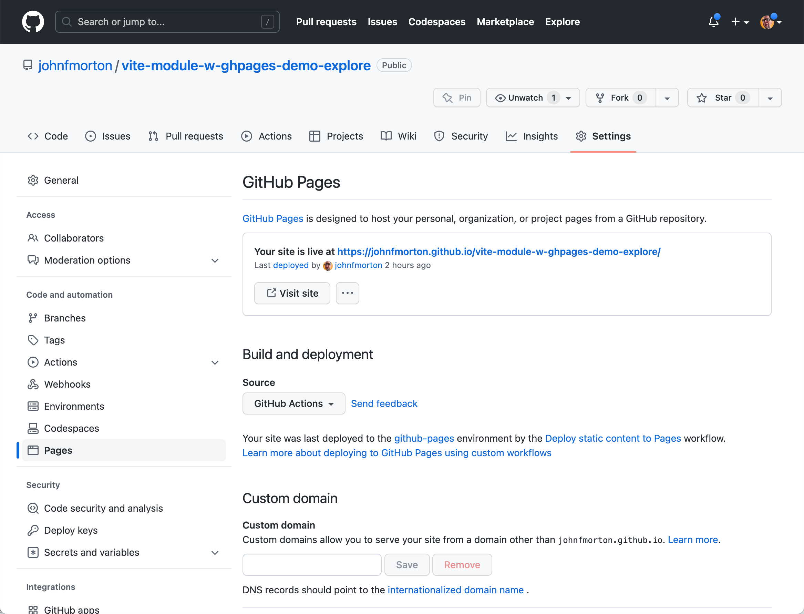
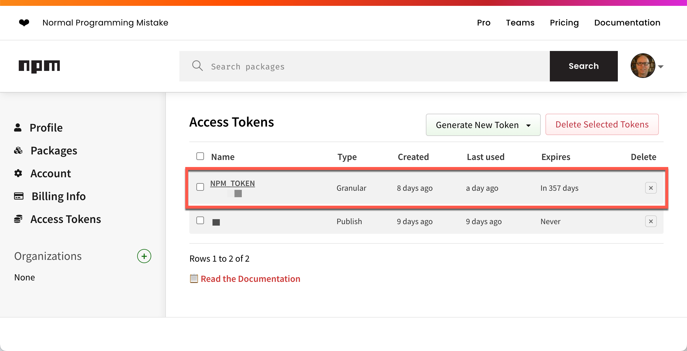
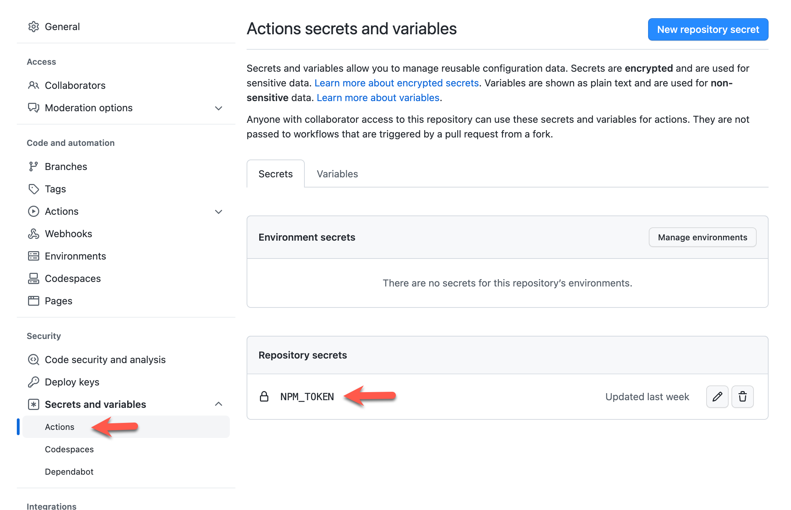
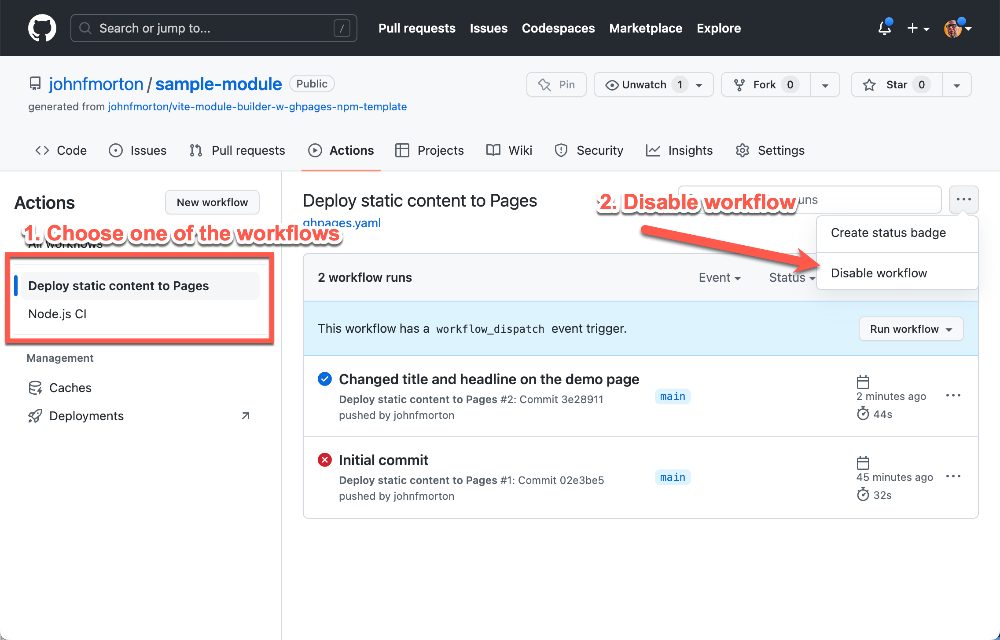

# Vite module builder template with automated GitHub Pages and npm publishing

This is a repo serves as a template workflow that uses Vite to help you create a module, exported as a Common JS module and an ES module.

It  features a development page to easily test your module during development. The development page is preconfigured with Tailwind CSS.

Two preconfigured GitHub Actions are also included. The first will plubish a demo page to GitHub pages every time you upload your changes to the `main` branch. The second workflow allows you to publish your module to NPM every time you push a commit to GitHub with a new version number in your package.json file.

You write your module in Typescript and your published module will include an automatically generated type definition file.

## Installation

You can use it as a template to create your own repo. You can do this by clicking the "Use this template" button on the repo's home page.

This will create a new repo in your GitHub account. You can then clone the repo to your local machine and start working on your module.

## Run the configuration script

This repo includes a configuration script that will help you update the name of your module and other settings. To run the script, you will need to have Node installed on your machine. You can download it from https://nodejs.org/en/download/.

Once you have Node installed, you can run the script by opening a terminal window and navigating to the root of the repo.

You will need to have two pieces of information to run the script:

1. The name of your module. This needs to be a valid name for a web componet. It can only contain lowercase letters, numbers, and dashes. It must start with a letter. It cannot contain spaces or any other characters.
2. The name of the GitHub repo URL. This is the URL of the repo you are working on. It should be in the format of `https://<USERNAME>.github.io/<REPO>/`.


Then run the following command:

```bash
npm run project-setup
```

This will replace all the instances of "vite-module-builder-w-ghpages-npm-template" with the name of your module. It will also update the `package.json` and `vite.demo.config.js` files with the git repository URL.

The script will also run `npm install` to install the dependencies for the repo. There is [additional information about the files](#additional-information-about-the-files) at the end of the document.


## How to work on your module

### Development

Once your files are updated, you can run `npm run dev` to start the development server for the demo page and get to work on your module by editing the typescript file in the `/lib` directory.

The demo page imports your module from the `/lib` directory so you can test it as you work on it. The script for your demo page is in the `/demo-page-assets` directory, `demo.ts`.

### GitHub Pages

The `.github/workflows/ghpages.yml` file is the workflow that will get your demo page published as the repo's demo page. You *must* set this up in your repo for it to work. You can do this by going to the repo's settings, then to the "Pages" section. Click the "Source" dropdown and select "GitHub Actions" as shown below.



### NPM publishing

In your GitHub repo, you will need a key from your NPM repository that will allow you to publish. This will be stored in your GitHub secrets for the repo. In the `.github/workflows/build.yml` file, you will need a reference to it, `secrets.NPM_TOKEN`. If you choose a different name for your secret, you will need to update the workflow file.



In the repo's settings, you will need to add the secret to the repo. You can do this by going to the repo's settings, then to the "Secrets and variables" section and then select the "Actions" section. Click the "New repository secret" button and add the secret as shown below.



This script only attempts to run when you change the version number in the `package.json` file. During early development, I don't set this up immediately. This means the intial push to GitHub will cause this script to fail. You can ignore this failure. Once you have set up NPM publishing, you can then update the version number in the `package.json` file and push the commit to GitHub. This will cause the script to run and publish your module to NPM.

### How to disable the GitHub Pages and NPM publishing

If you don't want to publish your demo page to GitHub Pages or your module to NPM, you can disable the workflows. I do this early in development to keep these processes running before I'm at that stage of development. You can do this by going to the repo's settings, then to the "Actions" section. Click the "Disable Actions" button as shown below.



You can re-enable the workflows by clicking the "Enable Actions" button on this same screen when you are ready.


## Additional information about the files

The configuration script should have updated all the files in the repo with the name of your module, but it is important to understand what is in the repo and how it works, keep reading.

The most important file in this repo is the `lib/vite-module-builder-w-ghpages-npm-template.ts` file.

The name of the file is important. It is the name of the module you are creating. You will need to update the name of the file and the name of the module in the file.

* index.html - The demo page for your module. Use it to test your module. It will also serve as the demo page for your module when you publish it to GitHub Pages.
* package.json - The package.json file for your module. You will need to update the name of the module in the file.
* README.md - The README.md file for your module. You will need to update the name of the module in the file plus create documentation for your module.
* vite.config.ts - The Vite configuration file for your module build process.
* vite.demo.config.js - The Vite configuration file for your demo page build process for GitHub Pages.
* lib/vite-module-builder-w-ghpages-npm-template.ts - The demo page imports this file to test your module. You will need to update the name of the module in the file.

For a working example, check out this repo: https://github.com/johnfmorton/progressive-share-button

You will see how I use "progressive-share-button" as the name of the module and the name of the file. I also use it in the `package.json` file.

`lib/vite-module-builder-w-ghpages-npm-template.ts` is where you create the module you are working on. For this demo, it is a simple function that looks for an HTML element with the id of "messageOutput" and then sets the text of that element to the message you pass in. The file serves as a starting point for you to build your module. Ultimately, you will use Vite to create a Command JS module and a ESM module. See the `package.json` file for references to both of these.

The other imporatnt page is the `index.html` file. This is the demo page for your module. It includes the `demo-page-assets/demo.ts` file which is where you will write the code to test your module. This page is using Vite for development and the build process.

You can see the demo page for this repo at:

https://johnfmorton.github.io/vite-module-builder-w-ghpages-npm-template/
